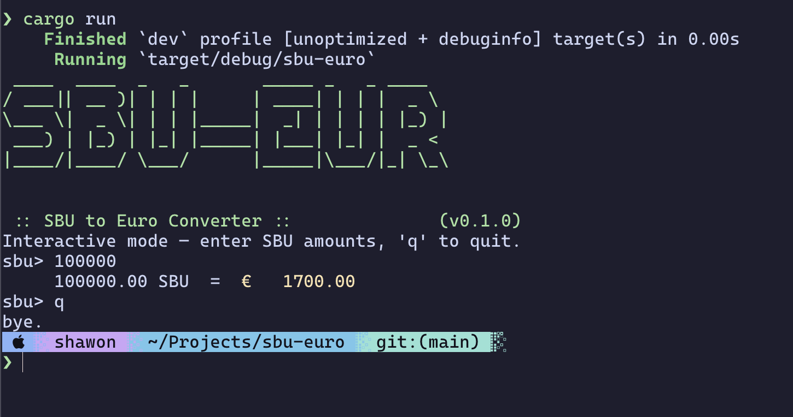

# sbu-to-euros

So, how to put it then .... this project is the aftermath of a fun conversation with a colleague on how much money our experiments actually cost when run on the Dutch Supercomputing Cluster Snellius. Someone found out that each 1000 SBUs cost 17€. This project / cli tool tells you how much money you would have spent for the SBUs you get were you not a researcher. xD


## running locally

```bash
# make sure to have rust installed
cargo run
```

## screenshot


